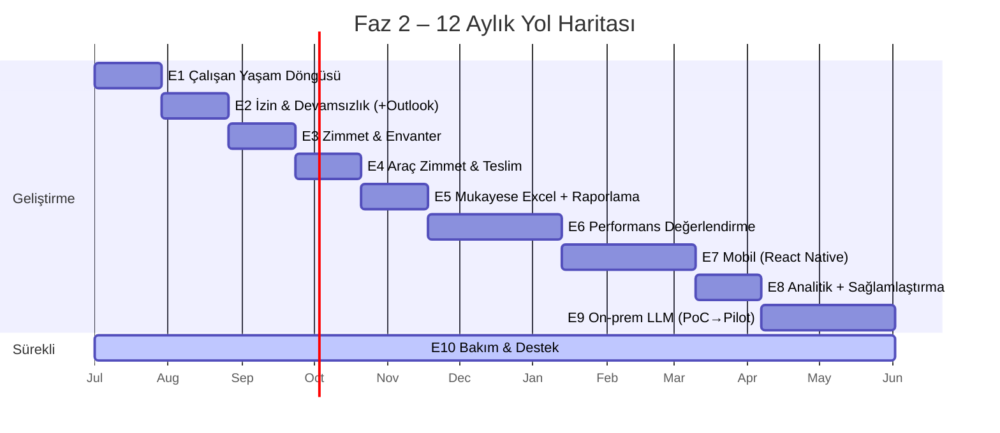

# RT Enerji – Faz 2 Yol Haritası (12 Ay)

### Şirket geneli süreç yönetim platformu — Faz 2 önceliği: İnsan Kaynakları

> **Durum:** Onay için taslak · **Dönem:** 12 ay · **Tarih:** Haziran 2026
> Sistemin mevcut işleyişi için: [genel-bakis.md](genel-bakis.md) · Onay süreçleri: [surec-bilgileri-prod.md](surec-bilgileri-prod.md)

---

## 1. Yönetici Özeti

**Faz 1'de ne yaptık?** RT Enerji'nin 14 onay sürecini (izin, fazla mesai, harcama, avans, mukayese, görev, kaşe, onay kapağı vb.) tamamen dijitalleştirdik. Talepler sistemde başlatılıyor, onay zincirinden geçiyor, süreç sonunda **imzalı/kaşeli PDF** üretilip SharePoint'e otomatik arşivleniyor. Sistem canlıda ve aktif kullanılıyor.

**Faz 2'de hedefimiz ne?** Bu sistem, şirketin **tüm departmanlarının** kullandığı genel bir süreç/iş akışı platformu olmaya devam ediyor. Faz 2'de platformu, süreçlerin ardındaki **alan yeteneklerini derinleştirerek** güçlendiriyoruz ve **önceliği İnsan Kaynakları** süreçlerine veriyoruz: sistem; kimin işe girdiğini/ayrıldığını, bugün kimin çalıştığını/izinli olduğunu, kime hangi demirbaş ve aracın zimmetli olduğunu bilen, çalışan performansını takip eden ve mobilden erişilen bir hâle gelecek. İlerleyen dönemde aynı derinleştirme **finans/muhasebe** süreçleri için de yapılabilir.

**Neden değerli?**
- 🎯 **Tek doğru kaynak:** Çalışan, izin, zimmet, performans bilgisi dağınık Excel'lerde değil, tek sistemde.
- ⚙️ **Manuel iş azalır:** İşe giriş/çıkışta çalışan tanımlama, izin bakiyesi, zimmet takibi otomatikleşir.
- 👁️ **Anlık görünürlük:** "Bugün kim çalışıyor?", "Bu demirbaş kimde?", "Kalan izni ne?" sorularına anında cevap.
- 📅 **Entegre:** Onaylanan izinler doğrudan Outlook takvimine düşer.
- 📱 **Her yerden erişim:** Onay/bildirim/talep akışları mobil (React Native) uygulamadan.
- 🚀 **Geleceğe hazırlık:** Veri yapılandıkça, yıl sonunda **şirket içi (on-prem) yapay zekâ asistanı** gibi stratejik yetenekler.

**12 ay nasıl ilerliyor?**

| Çeyrek | Tema |
|---|---|
| **Ç1** (Ay 1–3) | Bakım + Çalışan Yaşam Döngüsü + İzin/Devamsızlık + Zimmet |
| **Ç2** (Ay 4–6) | Araç zimmet + Mukayese Excel + Raporlama + Performans Değerlendirme |
| **Ç3** (Ay 7–9) | Performans Değerlendirme (tamamlama) + Mobil (React Native) |
| **Ç4** (Ay 10–12) | Sağlamlaştırma + Analitik + On-prem LLM (PoC→Pilot) |

---

## 2. Çalışma Modeli

1 yıllık bakım & geliştirme anlaşması iki paralel hat üzerinden yürür:

- **🛠️ Bakım & Destek (sürekli, tüm yıl):** Hata çözümü, eksik tamamlama, kullanıcı geri bildirimlerine göre küçük iyileştirmeler (**E10**).
- **🚧 Geliştirme (aylık epikler):** Aşağıdaki yeni yeteneklerin planlı teslimi.

> **Not:** Bu **yaşayan bir plandır.** İlk aylar somut ve taahhütlüdür; ileriki aylar canlıdan gelen önceliklere göre birlikte güncellenebilir. Çoğu epik **mevcut altyapının üstüne** bindiği için (tarihçeli çalışan modeli, workflow motoru, PDF/imza, Microsoft Graph) hızlı ilerleyebiliyoruz.

---

## 3. Zaman Çizelgesi

_(Başlangıç tarihi onay sonrası netleşir; çizelge görelidir.)_

---

## 4. Geliştirme Epikleri

| # | Epik | Ne kazandırır | Süre |
|---|---|---|---|
| **E1** | **Çalışan Yaşam Döngüsü** | İşe giriş→otomatik çalışan tanımı, çıkış→otomatik arşivleme | ~1 ay |
| **E2** | **İzin & Devamsızlık + Outlook** | İzin kaydı + bakiye + "kim çalışıyor" panosu + müsaitlik-duyarlı onay + Outlook takvim senkronu | ~1 ay |
| **E3** | **Zimmet & Envanter** | Demirbaş listesi, kişiye atama, imzalı teslim/iade tutanağı | ~1 ay |
| **E4** | **Araç Zimmet & Teslim** | Araç envanteri, kişiye atama, teslim/iade süreci | ~1 ay |
| **E5** | **Mukayese Excel İçe Aktarma** | Hazır Excel'i yükle→otomatik forma dönüştür | ~1 ay |
| **E6** | **Performans Değerlendirme** 🆕 | Değerlendirme dönemi, şablon, puanlama, çıktı raporu | ~2 ay |
| **E7** | **Mobil Uygulama (React Native)** 🆕 | Onay, push bildirim, talep görüntüleme; mevcut backend yeniden kullanılır | ~2 ay |
| **E8** | **Analitik + Sağlamlaştırma** | Yönetim panosu (hacim, onay süresi, darboğaz) + test/CI + ortam paritesi | ~1 ay |
| **E9** | **On-prem LLM Asistanı** _(Ar-Ge)_ | Sistem verisine dayalı, on-prem, KVKK-uyumlu soru-cevap | ~2 ay |
| **E10** | **Bakım & Destek** _(sürekli)_ | Hata çözümü, go-live iyileştirmeleri, hatırlatma/eskalasyon | Tüm yıl |

---

## 5. Aylık Yol Haritası

### 🟦 Ç1 (Ay 1–3)

- **Ay 1 — E1 Çalışan Yaşam Döngüsü** + go-live bakım yoğunluğu.
  - İşe Giriş formu bitince → otomatik çalışan kaydı. E-posta açıldıysa giriş yetkili kullanıcı; **e-postası yoksa (mavi yaka) yine de çalışan olarak tanımlanır**, sadece giriş yapamaz.
  - İşten Çıkış formu bitince → otomatik arşivleme (çıkış tarihi, pasifleştirme, açık zimmet/izin uyarısı).
- **Ay 2 — E2 İzin & Devamsızlık (İK çekirdeği) + Outlook.**
  - İzin bakiyesi otomasyonu (hak ediş/kullanılan/kalan), devamsızlık panosu, takım takvimi.
  - **Müsaitlik-duyarlı onay:** onaycı izinliyse talep vekiline/alternatif onaycıya yönlendirilir.
  - **Outlook takvim senkronu:** onaylanan izin → kişinin (ve isteğe bağlı ekibin) Outlook takvimine etkinlik. _(Mevcut Graph Calendar entegrasyonu üzerine.)_
- **Ay 3 — E3 Zimmet & Envanter.** Demirbaş listesi + kişiye atama + imzalı teslim/iade tutanağı; işten çıkışla entegrasyon (açık zimmet kontrolü).

### 🟩 Ç2 (Ay 4–6)

- **Ay 4 — E4 Araç Zimmet & Teslim.** Araç envanteri + araca özel teslim/iade (E3 ile ortak "varlık zimmeti" deseni). _(Opsiyonel: muayene/bakım/sigorta hatırlatma.)_
- **Ay 5 — E5 Mukayese Excel İçe Aktarma** + raporlama altyapısı başlangıcı. Hazır Excel yüklenir, sistem parse edip mukayese formuna dönüştürür _(go-live geri bildirimi)_.
- **Ay 6 — E6 Performans Değerlendirme (Faz 1).** Değerlendirme dönemi tanımı, şablon/kriter, puanlama akışı.

### 🟨 Ç3 (Ay 7–9)

- **Ay 7 — E6 Performans Değerlendirme (tamamlama).** Değerlendirme süreci, sonuç/rapor çıktıları, çalışan kartına bağlama.
- **Ay 8–9 — E7 Mobil Uygulama (React Native).**
  - **MVP kapsamı:** giriş (Azure/Supabase), bekleyen onaylar + onayla/reddet, **push bildirim**, talep görüntüleme, bildirim merkezi.
  - Mevcut Supabase backend ve API uçları yeniden kullanılır (backend baştan yazılmaz).
  - _(Form doldurma + mobil imza parite, kapsam/süreye göre ikinci dalga olabilir.)_

### 🟪 Ç4 (Ay 10–12)

- **Ay 10 — E8 Analitik + Sağlamlaştırma.** Yönetim panosu (süreç hacmi, ortalama onay süresi, darboğaz, izin/zimmet özetleri) + otomatik test/CI + **dev↔prod ortam paritesi** _(canlıya geçişte görülen farklar giderilir)_.
- **Ay 11–12 — E9 On-prem LLM (fizibilite → PoC → pilot)** + yıl içi biriken istekler için **tampon** (Bölüm 7).

---

## 6. Epik Detayları

**E1 – Çalışan Yaşam Döngüsü.** İşe Giriş/İşten Çıkış takip formları çalışan kaydına canlı bağlanır. Sistem zaten tarihçeli organizasyon modeline sahip olduğundan doğal bir genişlemedir.

**E2 – İzin & Devamsızlık + Outlook.** Onaylı izinler merkezi kayda işlenir → bakiye otomasyonu, devamsızlık panosu, takım takvimi, müsaitlik-duyarlı onay. **Outlook takvim senkronu** bu epiğe dahildir (Graph Calendar mevcut).

**E3 – Zimmet & Envanter.** Envanter ana listesi + kişiye atama + teslim/iade süreci (imzalı tutanak mevcut PDF/imza altyapısıyla). İşten çıkışta açık zimmet kontrolü.

**E4 – Araç Zimmet & Teslim.** Araç envanteri + teslim/iade; E3 ile ortak altyapı.

**E5 – Mukayese Excel İçe Aktarma.** Yüklenen Excel parse edilip mevcut mukayese veri modeline (kalem/firma/fiyat matrisi) dönüştürülür. Düşük öncelik.

**E6 – Performans Değerlendirme (yeni).** Değerlendirme dönemi, şablon/kriter setleri, puanlama ve onay akışı, sonuç raporları; çalışan kartına işlenir. Yeni bir İK modülü.

**E7 – Mobil Uygulama / React Native (yeni).** Ayrı bir mobil uygulama; **mevcut Supabase backend ve API uçlarını yeniden kullanır.** İlk dalga: onay, push bildirim, talep görüntüleme. Push altyapısı (Expo/FCM/APNs) yeni bir bileşendir.

**E8 – Analitik + Sağlamlaştırma.** Yönetsel raporlama panosu + test/CI + dev/prod ortam paritesi + performans.

**E9 – On-prem LLM Asistanı (Ar-Ge).** Bölüm 7.

**E10 – Bakım & Destek (sürekli).** Hata çözümü, eksik tamamlama, küçük UX iyileştirmeleri, hatırlatma/eskalasyon. 1 yıllık anlaşmanın "bakım" tarafı; tüm yıl akar.

---

## 7. On-prem LLM Asistanı — Stratejik Değerlendirme

> Şirket sahibinin önerisiyle gündeme gelen, **şirket sunucularında çalışan ve yönetim sistemimizden beslenen** bir yapay zekâ asistanı. **Taahhütlü modül değil**, kontrollü bir **Ar-Ge → PoC → Pilot** yolculuğu olarak ele alınır.

**Vizyon:** Doğal dille soru-cevap: _"Bugün kaç kişi izinli?"_ · _"Bekleyen onaylarım?"_ · _"Geçen çeyrek harcama toplamı, en çok hangi birimde?"_ · _"Bu çalışana hangi demirbaşlar zimmetli?"_

**Neden uygun zemin var?**
- Veri **yapılandırılmış** (PostgreSQL) → güvenilir "soru → SQL → cevap"; üretilen PDF'ler belge soru-cevabı için kaynak.
- **On-prem + KVKK:** Hassas İK verisi şirket dışına çıkmaz — on-prem yaklaşımın en güçlü gerekçesi.

**Gerçek kısıtlar (şeffaf):**
- **Donanım:** Yerel modelin makul hızda çalışması için sunucu/GPU gerekir; bütçe/temin şirketçe planlanmalı.
- **Doğruluk:** LLM "uydurabilir" → cevaplar daima **gerçek veriye dayandırılmalı** (retrieval + SQL) ve kaynak gösterilmeli.
- **Yetki/güvenlik:** Asistan, kullanıcının **görmeye yetkili olmadığı** veriyi getirmemeli (mevcut RLS/izin kurallarına saygı). Tasarımın en kritik parçası.
- **Bakım:** Model, veri hattı ve değerlendirme sürekli bakım ister.

**Aşamalı plan (Ç4):** (1) **Fizibilite:** senaryoları daralt, donanım/model/maliyeti netleştir. (2) **PoC:** 3–5 yüksek değerli, salt-okunur, yetki-duyarlı, kaynak gösteren senaryo. (3) **Pilot:** sınırlı grupla; doğruluk/yanıt süresi/memnuniyet ölçülür → Faz 3 kararı.

---

## 8. Başarı Ölçütleri (öneri)

- İşe giriş/çıkışta **çift veri girişinin** ortadan kalkması.
- "Bugün kim çalışıyor/izinli" bilgisinin **anlık** ve doğru olması; izin bakiyesinin manuel İK işinden çıkması.
- Onaylı izinlerin **Outlook takvimine** otomatik düşmesi.
- Zimmetli demirbaş/araçların **%100 sistemde** kayıtlı olması.
- Onay sürelerinde (özellikle "onaycı izinde" gecikmelerinde) ölçülebilir azalma.
- Mobil uygulamadan onay/bildirim akışının kullanılır olması.
