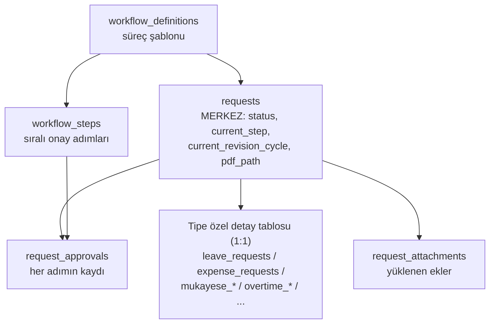
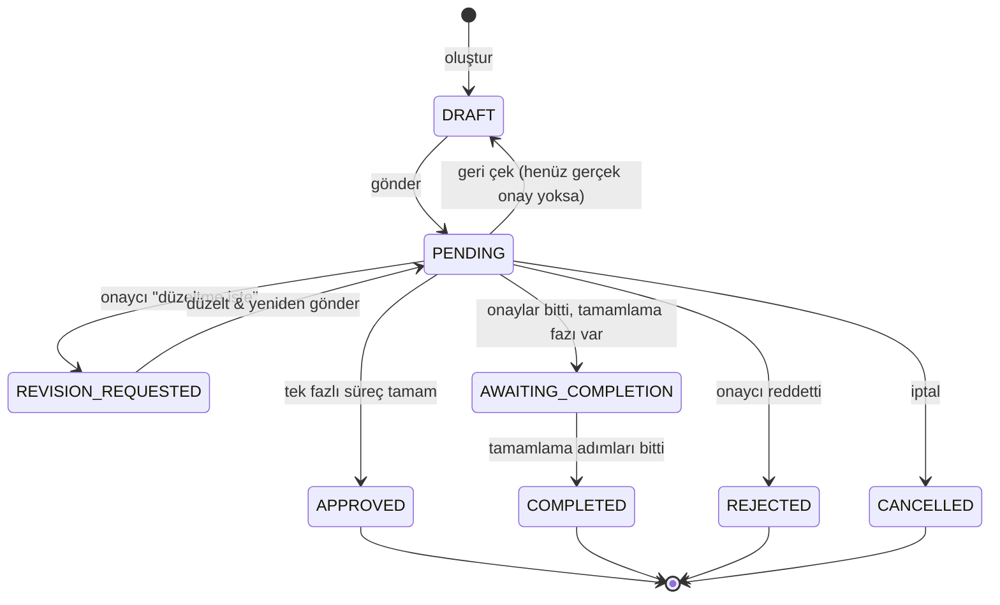
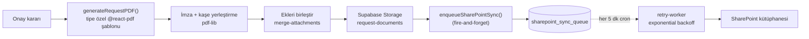

# RT Enerji – Sistem Genel Bakış

> Bu doküman, projenin **bütününün nasıl çalıştığını** tek yerden anlatır. Yeni başlayan biri için "önce buradan oku" dokümanıdır; ayrıntılar için sonunda listelenen konu dokümanlarına yönlendirir.
>
> _Not: Eski `README.md`, projenin ilk hâlini (yalnızca organizasyon yönetimi MVP'si) anlatır ve günceli yansıtmaz. Güncel resim için bu doküman esas alınmalıdır._

---

## 1. Sistem ne işe yarar?

RT Enerji için geliştirilmiş, iki ana yeteneği birleştiren bir **kurumsal onay/iş akışı + organizasyon yönetim platformu**:

1. **Organizasyon yönetimi** — Şirketler, organizasyon birimleri, pozisyonlar, çalışanlar ve bunların **tarihçeli** atamaları; organizasyon şeması görselleştirmesi.
2. **Onay süreçleri (workflow)** — İzin, fazla mesai, harcama, avans, mukayese, görev, kaşe onayı, onay kapağı vb. **14 farklı form**, her biri kendi onay zinciriyle dijital olarak yürütülür; süreç sonunda **imzalı/kaşeli PDF** üretilip SharePoint'e arşivlenir.

Tanımlı onay süreçlerinin tam listesi ve onay zincirleri için: [surec-bilgileri-prod.md](surec-bilgileri-prod.md).

---

## 2. Teknoloji yığını

| Katman | Teknoloji |
|---|---|
| Frontend | **Next.js 16** (App Router) · **React 19** · TypeScript |
| UI | shadcn/ui (Radix) · Tailwind CSS v4 · lucide-react · next-themes · sonner · motion |
| Form | react-hook-form + **Zod** (`@hookform/resolvers`) |
| Backend | **Supabase** — PostgreSQL + Auth + Storage + Realtime |
| Kimlik | **Microsoft Azure / Entra ID SSO** (`@rtenerji.com`) |
| Entegrasyon | **Microsoft Graph** — Mail, Calendar, To-Do, SharePoint |
| Belge | `@react-pdf/renderer` (PDF üretimi) · `pdf-lib` (kaşe/imza/birleştirme) · ExcelJS/xlsx (dışa aktarım) |
| Görselleştirme | ReactFlow + ELK (org chart) · TipTap (zengin metin) |
| Arka plan işleri | **pg_cron + pg_net** (SharePoint senkron retry — her 5 dk) |

---

## 3. Yüksek seviye mimari

```mermaid
flowchart LR
  U[Kullanıcı<br/>@rtenerji.com] -->|Azure SSO| APP[Next.js 16 App<br/>App Router]
  APP -->|"@supabase/ssr"| SB[(Supabase<br/>Postgres · Auth · Storage · Realtime)]
  APP -->|Microsoft Graph| M365[Microsoft 365<br/>Mail · Calendar · SharePoint]
  SB -. RLS .- SB
  PGCRON[pg_cron / pg_net<br/>her 5 dk] -->|"POST /api/cron/sharepoint-sync-retry"| APP
  APP -->|imzalı/kaşeli PDF| SP[SharePoint Belge Kütüphanesi]
```

- **Tek bir Next.js uygulaması** hem arayüzü (Server/Client Components) hem de API uçlarını (`app/api/...`) barındırır.
- **Supabase** verinin tek kaynağıdır; erişim **RLS (Row Level Security)** ile satır düzeyinde kısıtlanır.
- **Microsoft 365** kimlik (SSO), bildirim e-postaları, takvim/görev ve belge arşivi için kullanılır.
- Ağır/başarısız olabilen işler (SharePoint yükleme) **kuyruk + cron retry** ile asenkron yürütülür.

---

## 4. Kimlik doğrulama & yetkilendirme

**Giriş akışı** ([../app/auth/login/page.tsx](../app/auth/login/page.tsx) → [../app/auth/callback/route.ts](../app/auth/callback/route.ts)):

1. Kullanıcı **Microsoft (Azure/Entra) SSO** ile giriş yapar (`signInWithOAuth`, provider `azure`). Sadece `@rtenerji.com` hesapları kabul edilir.
2. Callback'te oturum açılır; Microsoft delegated token'ları (`access_token`/`refresh_token`) **`user_ms_tokens`** tablosuna yazılır.
3. Oturum çerezi yeniden üretilerek **incelitilir** (provider token'ları çerezden çıkarılır) — Vercel'de HTTP/2 header limitini aşmamak için. _(Ayrıntı: [project_prod_http2_cookie_bloat])_

**Kullanıcı sağlama (provisioning):** `auth.users`'a ilk kayıt düştüğünde bir trigger (`handle_auth_user_created`, bkz. [../dev_schema.sql](../dev_schema.sql)) `public.app_users` kaydı açar; e-posta ile `employees` tablosunda eşleşme ararsa `employee_id`'yi otomatik bağlar, bulamazsa boş bırakır (kullanıcı yine girebilir).

**Roller** (`app_users.role`):
- **`ORG_ADMIN`** — Tam yetki: organizasyon yönetimi, tüm workflow'ları başlatma, her talebi yönetme (RLS'i aşan ayrı politikalar).
- **`ORG_VIEWER`** — Varsayılan rol: kendi taleplerini oluşturur/düzenler, atandığı onayları görür.

**Yetki katmanları:**
- **Middleware** ([../proxy.ts](../proxy.ts) → [../lib/supabase/proxy.ts](../lib/supabase/proxy.ts)) her istekte oturumu tazeler; oturumsuz kullanıcıyı `/auth/login`'e yönlendirir (API uçları 401 JSON döner).
- **RLS politikaları** (≈160 adet) — temel desen: *talep sahibi VEYA o talebin onaycısı VEYA ORG_ADMIN* görebilir/düzenleyebilir. `get_current_employee_id()` ve `is_approver_for_request()` gibi `SECURITY DEFINER` fonksiyonları bu kontrolü sağlar.
- **Uygulama düzeyi** — workflow başlatma izni `canStartWorkflow()` ile kontrol edilir (bkz. §6).
- **Supabase client'ları** ([../lib/supabase/](../lib/supabase/)): tarayıcı (`client.ts`), sunucu (`server.ts`, SSR çerezleri) ve **service-role** (`service-role.ts`, RLS'i aşan güvenilir sunucu işlemleri — PDF üretimi, cron vb.).

---

## 5. Veri modeli — "hub-and-spoke"

Her talep, merkezde tek bir **`requests`** satırıdır; ona bağlı **bir adet tipe özel detay tablosu (1:1)** ve süreç takibi için workflow tabloları durur.



**Tablo grupları** (≈41 public tablo; tipler `../lib/database.types.ts`, şema `../dev_schema.sql`):

- **Organizasyon modeli (tarihçeli):** `companies`, `organizational_units` (kendine referanslı hiyerarşi), `positions` (`is_unit_head`, `reports_to_position_id`), `employees`, `employee_positions` (**tarih aralıklı** atama → kariyer/organizasyon geçmişi), sözlükler: `unit_types`, `position_types`, `grade_levels`.
- **Workflow çekirdeği:** `requests` (merkez), `workflow_definitions` (şablon), `workflow_steps` (sıralı adımlar), `request_approvals` (çalışma anı onay kayıtları), `workflow_initiators` (başlatma kısıtı), `request_attachments` + `workflow_step_attachments` (ek dosya).
- **Tipe özel detay tabloları (her biri bir `requests` satırıyla 1:1):** `leave_requests`, `overtime_requests`/`overtime_entries`, `expense_requests`/`expense_items`, `salary_advance_requests`, `mukayese_requests`/`mukayese_items`/`mukayese_suppliers`/`mukayese_prices` (fiyat matrisi), `travel_assignment_requests`, `separation_requests`, `onboarding_requests`, `stamp_requests`, `approval_letter_requests`, `finance_approval_cover_requests`/`_items`, `accounting_approval_cover_requests`/`_items`, `request_form_requests`.
- **Diğer:** `app_users` (auth↔çalışan + rol), `notifications` (uygulama içi bildirim), `stamps` (kaşe görselleri), `user_ms_tokens` (MS Graph token deposu), `sharepoint_sync_queue` (asenkron arşiv kuyruğu).

> **İncelik:** `requests.parent_request_id` ile talepler birbirine bağlanabilir (örn. bir talepten türeyen bağımlı süreç). Organizasyon modeli tarihçeli olduğundan, onay zinciri kuralları (örn. "birim amiri") talebin oluştuğu andaki pozisyona göre çözülebilir.

---

## 6. İş akışı (workflow) motoru

Çekirdek mantık [../lib/workflow/](../lib/workflow/) altındadır (`workflow-service.ts`, `lifecycle.ts`, `notification-service.ts`, `types.ts`).

**Bir süreç nasıl tanımlanır?**
- `workflow_definitions` = süreç şablonu (kod, ad, `is_restricted`, `is_active`).
- `workflow_steps` = o şablonun sıralı adımları. Her adımın önemli alanları:
  - **`approver_type`** — onaycı kim:
    - `REQUESTER` — talebi açanın imza adımı (otomatik onaylanır, gerçek karar değildir),
    - `UNIT_HEAD` — talep sahibinin **birim amiri** (kişi kendisi amirse bir üst birime *yukarı doğru tırmanır*),
    - `STATIC_POSITION` — sabit bir pozisyonu dolduran kişi (örn. Finans Müdürü),
    - `DYNAMIC_USER_LIST` — talep oluşturulurken seçilen "ilgili kişiler".
  - **`action_type`** — `FILL_AND_SIGN` (alan doldurup imzalar) / `SIGN_ONLY` (sadece imza; aynı kişi sonraki imza adımındaysa otomatik ilerletilir).
  - **`phase`** — `APPROVAL` (normal onay) / `COMPLETION` (onay sonrası tamamlama adımı, örn. görev formunda gerçekleşen tarihlerin asistanca girilmesi).
  - **`condition`** (koşullu adım) — JSON `{field, value}`; koşul tutmazsa adım atlanır (örn. avans istenmediyse muhasebe adımı yok).

**Talep oluşturma → onay zinciri kurma** (`createApprovalChain()`):
1. Şablon adımları sırayla okunur; koşulu tutmayan adımlar atlanır.
2. Her adım için onaycı çözülür (yukarıdaki `approver_type` kurallarına göre; `UNIT_HEAD` için `determineUnitHeadApprover()` yukarı tırmanma mantığı).
3. `request_approvals` satırları açılır; `REQUESTER` adımı otomatik onaylanır; ilk bekleyen adım `current_step` olur.
4. Tüm adımlar otomatik onaylanmışsa talep doğrudan onaylanmış sayılır (PDF üretimi + bildirim).

**Kim başlatabilir?** `canStartWorkflow()` — `ORG_ADMIN` her şeyi başlatabilir; kısıtlı (`is_restricted`) süreçlerde kullanıcının pozisyonu/birimi `workflow_initiators` kurallarıyla eşleşmelidir. Kullanıcıya görünen workflow listesi `getAvailableWorkflows()` ile filtrelenir (sidebar buna göre öğe gizler).

**Vekalet (Faz B):** Onaycı izindeyken tanımladığı vekil, onun bekleyen adımlarını vekalet penceresi içinde işler; satır taşınmaz, yetki DB'deki `can_act_on_approval()` ile işlem anında çözülür (RLS, bekleyen onaylar view'ı ve route'lar aynı fonksiyonu kullanır — `lib/workflow/delegation.ts`). İşlemi fiilen yapan `request_approvals.acted_by_employee_id`'ye yazılır; PDF'te vekilin kendi imzası ve "Vekaleten" etiketi görünür. Kapsam şimdilik yalnız Finans Onay Kapağı. Tasarım: [onay-havuzu-ve-vekalet-plan.md](onay-havuzu-ve-vekalet-plan.md).

Süreç → onaycı eşlemelerinin tamamı: [workflow-approvers-prod.md](workflow-approvers-prod.md) / [workflow-approvers-dev.md](workflow-approvers-dev.md). Motorun evrim dokümanları: [v4-workflow-engine-conditional.md](v4-workflow-engine-conditional.md), [v5-workflow-engine-lifecycle.md](v5-workflow-engine-lifecycle.md).

---

## 7. Talep yaşam döngüsü



Durumların UI karşılıkları (`../lib/approvals/constants.ts`): **DRAFT**=Taslak, **PENDING**=Beklemede, **REVISION_REQUESTED**=Revize İstendi, **APPROVED**=Onaylandı, **AWAITING_COMPLETION**=Tamamlanma Bekleniyor, **COMPLETED**=Tamamlandı, **REJECTED**=Reddedildi, **CANCELLED**=İptal Edildi.

**Onay kararı** (`PATCH /api/approvals/[id]`) dört duruma ayrılır: (1) son APPROVAL adımı onaylandı ve tamamlama fazı yok → **APPROVED** + PDF, (2) tamamlama fazına geçildi → **AWAITING_COMPLETION**, (3) tamamlama da bitti → **COMPLETED** + final PDF, (4) sıradaki adım var → `current_step` ilerletilir + sonraki onaycı bilgilendirilir.

**Revize döngüsü (v5):** `requests.current_revision_cycle` ve `request_approvals.revision_cycle` ile yönetilir. "Geri çek / Düzeltme iste / Yeniden gönder" akışlarında eski döngü onayları **denetim için saklanır**; aktif olan yalnız güncel döngüdür. PDF, e-posta ve geçmiş görünümleri **güncel döngüye filtrelenir** (`lib/workflow/lifecycle.ts`).

---

## 8. Belge üretim & arşivleme hattı

Bir talep onaylandığında (ya da reddedildiğinde/tamamlandığında):



- **PDF üretimi** [../lib/pdf/](../lib/pdf/): her form tipinin kendi `@react-pdf/renderer` şablonu var (izin, harcama, mukayese (A3), fazla mesai, onay kapağı, görev, vb.).
- **İmzalar** [../lib/signature/](../lib/signature/): ya **yazı tipi tabanlı** (çalışanın `signature_text` + `signature_font` — Ballet/Great Vibes/Sacramento) ya da **çizim tabanlı** (`react-signature-canvas`, `signatures` bucket'ı). Onaylanmış adımların imzaları PDF'e işlenir.
- **Kaşe** [../lib/stamp-position/](../lib/stamp-position/) + `pdf-lib`: kaşe görseli seçilen sayfalara, oransal konumlandırmayla basılır (Kaşeli Belge Onayı süreci).
- **Arşiv** [../lib/sharepoint/](../lib/sharepoint/): PDF, **asenkron** olarak SharePoint'e yüklenir. Yükleme `sharepoint_sync_queue`'ya kaydedilir; başarısız olanlar `/api/cron/sharepoint-sync-retry` ile **her 5 dakikada** artan bekleme (backoff) ile yeniden denenir. Başarıda `requests` tablosuna `sharepoint_*` alanları yazılır.

> **İncelik (prod'a özel):** `pg_cron` + `pg_net` ve SharePoint senkron işi **yalnızca prod ortamında** kuruludur; dev'de yoktur, dolayısıyla bu yol dev'de test edilmez. Cron işi prod Vault'taki `app_url` ve `sharepoint_cron_secret` secret'larına bağlıdır.

---

## 9. Bildirimler

İki kanal (`../lib/workflow/notification-service.ts`):
- **Uygulama içi:** `notifications` tablosu + **Supabase Realtime** ile canlı (zil ikonu / popover). İstemci tarafı [../lib/stores/](../lib/stores/) (Zustand notification store) ve [../hooks/use-notification-subscription.ts](../hooks/use-notification-subscription.ts).
- **E-posta:** Microsoft Graph `sendMail` ([../lib/email/](../lib/email/)) ile renk kodlu HTML şablonlar (onay gerekli / onaylandı / reddedildi / güncellendi …), içinde onay zinciri durumu ve CTA bağlantısı.

Tipler: `APPROVAL_REQUIRED`, `REQUEST_APPROVED`, `REQUEST_REJECTED`, `REQUEST_CANCELLED`, `REQUEST_UPDATED`, `REVISION_REQUESTED`.

---

## 10. Frontend yapısı

**Ana modüller** ([../app/](../app/)):
- **Talep formları** (her biri `.../new` ve düzenleme için `?edit=<id>`): `leave-requests`, `overtime`, `expense-form`, `comparison-form` (mukayese), `travel-assignment`, `salary-advance`, `separation`, `onboarding`, `stamp-approval`, `approval-letter`, `finance-approval-cover`, `accounting-approval-cover`, `request-form`.
- **Takip & onay:** `my-requests` (kendi talepleri + detay), `approvals` + `approvals/history` (onay kuyruğu), `notifications`.
- **Organizasyon yönetimi (çoğunlukla admin):** `employees`, `positions`, `position-assignments`, `organizational-units`, `org-chart` (ReactFlow + ELK ile görselleştirme, Excel/PNG dışa aktarım).
- **Sözlükler** (`(dictionaries)` grubu, admin): `companies`, `unit-types`, `position-types`, `grade-levels`.
- **Diğer:** `_home` (dashboard — takvim & not widget'ları), `profile` (imza/ayarlar), `auth/*`.

**İstemci durumu & veri:**
- **Server Components** doğrudan `lib/supabase/server` ile veri çeker; **Client Components** `lib/supabase/client` (tarayıcı) kullanır.
- **`UserContext`** ([../lib/contexts/](../lib/contexts/)): kullanıcı kimliği, rolü, `employeeId` ve erişebildiği workflow kodları.
- **Zustand** ([../lib/stores/](../lib/stores/)): bildirim durumu.
- **URL tabanlı durum:** `my-requests`/listelerde filtre & sayfalama query param'larında tutulur (paylaşılabilir/geri-navigasyon dostu).

**Bileşenler** ([../components/](../components/)): `app-shell` (kök sarmalayıcı: tema + kullanıcı sağlayıcı + breadcrumb), `app-sidebar` + `nav-*` (role göre filtrelenen navigasyon), `ui/` (shadcn/ui), ve özellik klasörleri (`approvals/`, `my-requests/`, imza/kaşe/PDF bileşenleri). Formlar **react-hook-form + Zod** ile; dinamik satırlar (harcama/mukayese kalemleri) `useFieldArray` ile.

---

## 11. Repo dizin yapısı (özet)

```
rt-enerji-frontend/
├── app/
│   ├── api/                 # Backend uçları (talep CRUD, approvals, pdf, cron, admin, ...)
│   ├── auth/                # Azure SSO login + callback
│   ├── <form-tipi>/         # Talep formu sayfaları (.../new, ?edit=)
│   ├── my-requests/ approvals/ notifications/
│   ├── employees/ positions/ org-chart/ organizational-units/ position-assignments/
│   ├── (dictionaries)/      # Sözlük yönetimi (admin)
│   └── _home/ profile/
├── components/              # app-shell, app-sidebar, nav-*, ui/, özellik bileşenleri
├── lib/
│   ├── supabase/            # client / server / service-role / proxy
│   ├── workflow/            # motor: service, lifecycle, notifications, types
│   ├── approvals/ my-requests/
│   ├── pdf/ signature/ stamp-position/ storage/
│   ├── msgraph/ sharepoint/ email/
│   ├── contexts/ stores/
│   └── database.types.ts    # Supabase'ten üretilen tipler
├── sql/                     # şema / trigger / RLS SQL'leri
├── proxy.ts                 # Next.js middleware (oturum tazeleme)
└── docs/                    # bu doküman ve konu dokümanları
```

---

## 12. İlgili dokümanlar

| Konu | Doküman |
|---|---|
| Tüm onay süreçleri ve zincirleri | [surec-bilgileri-prod.md](surec-bilgileri-prod.md) |
| Süreç → onaycı eşlemeleri | [workflow-approvers-prod.md](workflow-approvers-prod.md) · [workflow-approvers-dev.md](workflow-approvers-dev.md) |
| Workflow motoru (koşullu adımlar) | [v4-workflow-engine-conditional.md](v4-workflow-engine-conditional.md) |
| Workflow motoru (yaşam döngüsü v5) | [v5-workflow-engine-lifecycle.md](v5-workflow-engine-lifecycle.md) |
| Ek dosya yönetimi | [workflow-attachments.md](workflow-attachments.md) |
| Organizasyon veri modeli | [organizasyon-veri-modeli.md](organizasyon-veri-modeli.md) |
| Veritabanı & Auth teknik tasarımı | [teknik-tasarim-veritabani-ve-auth.md](teknik-tasarim-veritabani-ve-auth.md) |
| SharePoint entegrasyonu | [sharepoint-integration-plan.md](sharepoint-integration-plan.md) · [sharepoint-kurulum-talimatlari.md](sharepoint-kurulum-talimatlari.md) |
| Kaşe (custom) | [../custom-kase.md](../custom-kase.md) |
| PDF canlı önizleme | [pdf-live-preview.md](pdf-live-preview.md) |
| Dashboard tasarımı | [home-dashboard-redesign.md](home-dashboard-redesign.md) |

---

## 13. Bilinmesi gereken incelikler

- **`REQUESTER` adımı gerçek karar değildir** — talep edenin imza adımı otomatik onaylanır; "geri çekilebilir mi" ve onay geçmişi hesaplarında dışarıda bırakılır.
- **`SIGN_ONLY` ileri-otomatik onay** — aynı kişi zincirin ilerisinde tekrar imzalayacaksa, o adımlar otomatik onaylanır (aynı formu defalarca imzalamamak için).
- **Revize döngüsü filtresi** — sorgular/PDF/e-posta daima `current_revision_cycle`'a göre filtrelenmeli; eski döngü kayıtları yalnız denetim içindir.
- **RLS vs service-role** — onay detayında (`GET /api/approvals/[id]`) önce hafif RLS sorgusuyla yetki doğrulanır, sonra service-role ile derin veri çekilir (iç içe RLS özyinelemesi/timeout'tan kaçınmak için).
- **Çerez incelitme** — Azure callback sonrası oturum çerezi küçültülür (Vercel HTTP/2 header limiti); MS token'ları çerez yerine `user_ms_tokens`'ta tutulur.
- **Prod-only altyapı** — SharePoint senkron cron'u (`pg_cron`/`pg_net`) sadece prod'da kuruludur; dev şeması aksi hâlde prod ile birebir aynıdır.
